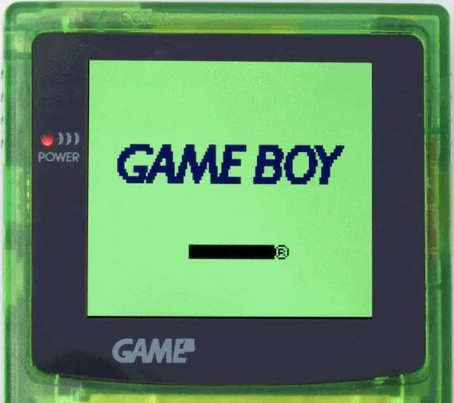

# PokeFlex

## Version 1 MVP

### Flex your pokemon knowledge with this guessing game. 

Fetch a sprite and a name from the pokeApi by index, using Math.random  

Take user input and compare with the correct name  

If correct the user get a nice message and a new pokemon is fetched   

If incorrect the user gets a clue and another attempt  

There are keyboard controls, cursor autofocus, a score count, and an attempt count  

Correct answer logs to the console for testing purposes and as a developer easter egg 

### Version 1 User Feedback

User feedback indicates that correct answer formatting on certain pokemon is unintuitive(eg. "mr-mime", "nidoran-m")  

User feedback indicates that the clearing user input after each guess would be convenient  

One user did not realise the keyboard controls were in place  

On small screens there is unintended zoom which needs investigating  

On small screens the title and subtitle are set to hide which might remove some meaning when landing  

There is no credits or link to GitHub or readMe for code accountability  

There is no victory conditions, no reward, and no feedback (There is poke but there is no flex)  

### Version 1.1

Add a start screen and ending credits

Added a time limit

Add a reward for completion

Add more complete keyboard controls

Start screen  

[v1.1 start screen](assets/images/Screenshot%202024-11-07%20124229.png)

Game screen  

[v1.1 game screen](assets/images/Screenshot%202024-11-07%20124241.png)

End credits  

[v1.1 end credits](assets/images/Screenshot%202024-11-07%20124405.png)

### Version 2 WIP

Multiple choice format to resolve user input and answer format problemsadd context and reduce overall visual clutter

## User stories - Must have(TBC)

## Credits

Styled like a game boy color:

https://handheldlegend.com/products/game-boy-color-ips-lcd-q5-hispeedido

[coolers.co](https://coolors.co/99ee95-0b1157)

Inspired by the Bro Code's tutorial on asynchronous fetch

https://www.youtube.com/watch?v=JVQNywo4AbU

Use the Pokemon Api to fetch an image of a random Pokemon

https://pokeapi.co/

When victory conditions are met the user is rewarded with a link to the pokerap

https://www.youtube.com/watch?v=xMk8wuw7nek